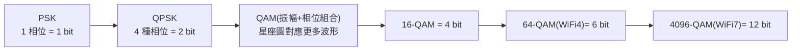
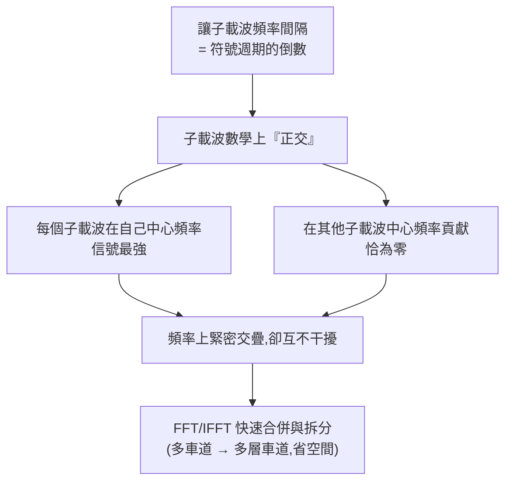

# WiFi 是怎麼傳遞資訊的?把資訊裝進電磁波的硬核原理

> 來源:硬件茶談〈【硬核科普】WiFi 是怎么传递信息的?把信息装进电磁波有多难?〉。從底層原理拆解:WiFi 如何用看不見的電磁波,精準承載海量資料。一條主線——**怎麼把 0 與 1 刻進電磁波、又怎麼在有限的頻譜裡擠進越來越多資料**:從調變(QAM)到頻譜復用(OFDM)再到空間復用(MIMO),這也是 WiFi 4 一路演進到 WiFi 7 的速度躍升之路。

---

## 一句話總結

WiFi 的每一次提速,本質都是「**與物理定律的一次巧妙談判——不打破規則,但無限逼近極限**」:用 **QAM** 在電磁波的「振幅 + 相位」上刻下更多位元、用 **OFDM** 在狹窄頻譜裡擠進上千條互不干擾的車道、用 **MIMO** 在同一空間開闢平行通道。三者疊加,就是現代 WiFi 又快又穩的祕密。

---

## 第一部分:電磁波怎麼隔空傳資訊

**從「波」說起(類比):** 在水缸按壓小球產生水波,對面小球能感受到相同的波;規定「有波=1、無波=0」配摩斯電碼就能傳資訊——但效率極低又得灌滿水。換成兩塊磁鐵(同性相斥、異性相吸)可隔空傳,但磁力太弱、一拉開距離就**衰減**到無法感知。要遠距離傳,需要更好的載體——**電磁波**。

**電磁波發現史(三個關鍵):**
- **1820 奧斯特**:給導線通電,周圍產生磁場 → 電生磁。
- **1831 法拉第**:磁鐵在線圈內前後移動,線圈產生電流 → 磁生電。
- **1887 赫茲**:感應線圈火花放電時,幾公尺外金屬環也跳火花 → **證實電磁波存在**。

**怎麼收發:** 天線接電子震盪器,驅動天線內電子加速運動 → 周圍激發交替變化的電場與磁場(電場激發磁場、磁場維持電場),電磁波像水波般向四周輻射。遠處另一根天線收到時,電場驅動其電子做受迫運動 → 產生與發射端**波形相同的感應電流**,解讀波形就還原了資訊。依發射功率,電磁波可在幾公分到幾光年間傳輸,**且真空中也能傳、不受介質影響**——完全滿足無線通訊需求。

---

## 第二部分:把資訊「裝進」電磁波 — 調變

電磁波有三個可操作屬性:**振幅、頻率、相位**。最基本的三種調變(每週期 1 位元):

| 調變 | 用什麼區分 0/1 | 名稱 |
|---|---|---|
| **ASK 調幅鍵控** | 振幅高低(低=0、高=1) | Amplitude-Shift Keying |
| **FSK 調頻鍵控** | 頻率快慢(低=0、高=1) | Frequency-Shift Keying |
| **PSK 相移鍵控** | 相位有無偏移(沒移=0、移了=1) | Phase-Shift Keying |

**怎麼一次傳更多位元?**

- **QPSK**:對相位做更精細控制,區分 4 種相位 → 一個信號用 4 種波形代表 2 位元,速度翻倍。
- **QAM(正交幅度調變)**:同時改變**相位 + 振幅**,排列組合出更多波形(如 16 種)。工程師用**星座圖(constellation diagram)**——夾角代表相位、長度代表振幅,每個點對應一組二進位值,實現「波形 ↔ 座標 ↔ 二進位」轉換。16-QAM 一個信號帶 4 位元。
- **QAM 是現代所有高速通訊的基石**,廣用於 4G、5G、數位廣播電視。WiFi:**WiFi 4 用 64-QAM(6 bit)→ WiFi 7 已做到 4096-QAM(一符號 12 bit)**。

**符號(symbol)與它的物理極限:**
- 與資料一一對應的波形叫**符號**;收發雙方約定固定間隔(如 8 微秒)發送,稱**符號保持時間**。
- **問題:多徑反射**。信號常經多次反射才到達,不同路徑到達時間錯位 → 前一符號延遲的尾巴與後一符號開頭重疊(**符號間干擾 ISI**),接收端無法區分。
- **解法:循環前綴(cyclic prefix)** ——在每個符號前加一段當保護間隔。但循環前綴長度必須大於多徑反射的最大時延差,**所以符號保持時間難以縮短**,單路信號上難再塞更多資料 → 得另尋他法。

---

## 第三部分:在有限頻譜裡擠出更多車道 — FDM → OFDM

**FDM(頻分復用):** 像聽歌時靠音調(頻率)區分樂器——多個不同頻率的電磁波即使混合,也能用**濾波器**分離。創造多路不同頻率的波形、各自做 QAM、疊加後合併發射,接收端用濾波器分離各路解調。**單車道 → 多車道、串行 → 並行**,每條車道不快但總能力大增。這些「頻率不同、各自承載獨立資料」的波形稱**子載波**。

**問題:** 真實電波不是理想細線,一個頻率會佔用左右一小段連續範圍(**頻譜空間**)。傳統 FDM 為避免子載波互相干擾,要留**保護間隔**,實際佔用頻譜很寬;但無線頻譜是稀缺資源、分配給 WiFi 的很有限。

**OFDM(正交頻分復用)** —— 巧妙解法:

- 只要讓子載波間隔**恰等於符號週期的倒數**,子載波就**正交**:各自在自己中心頻率最強、在別人中心頻率貢獻為零 → 頻率緊密交疊卻互不干擾。
- 發送方用**逆快速傅立葉變換(IFFT)** 合併、接收方用 **FFT** 拆分。
- 相比 FDM 大幅提高頻譜利用率(多車道 → 多層高架)。WiFi 一個 **20MHz 信道可容納數十個正交子載波**,**160MHz 信道可達上千個**,速度疊加。

---

## 第四部分:在虛空中開平行通道 — MIMO

頻譜被壓榨到極限後,還想更快怎麼辦?**MIMO(多輸入多輸出)**:加多根天線、同時發送多股不同資料流,接收方也用多根天線同時收。

> **三層比喻:** FDM 是單車道→多車道;OFDM 是把車道疊起來變高架橋;**MIMO 是直接又修一條新路**。

- **為何多天線不互相干擾?** 像人用兩耳聽方位、兩眼感知距離——多天線信號在空間經不同反射路徑,到達時帶上各自的**空間指紋**,接收端利用差異把混疊信號分離。
- **空間復用模式**:常見 2×2 MIMO(收發各 2 天線),理想下速度翻倍。
- **空間分集模式**:即使接收端只有一根天線,多發射天線經多路徑到達提供**冗餘**,讓連接更穩定。
- WiFi 5 → 6 → 7,天線數從 **4×4 到 8×8**,速度水漲船高。
- 配合 **OFDMA + MIMO**,路由器能在同一時刻服務多個裝置、各自跑滿速度——這就是現代 WiFi 又快又穩的祕密。

---

## 應用案例:用這套原理看懂日常 WiFi

- **買路由器看規格:** 「WiFi 7、4096-QAM、160MHz、8×8 MIMO」現在能看懂了——4096-QAM 是「每符號刻 12 位元」、160MHz 是「頻譜車道更寬(上千子載波)」、8×8 MIMO 是「八條平行空間通道」,三者都在堆速度。
- **為什麼隔牆變慢:** 牆造成更多多徑反射與衰減,訊噪比下降 → 自動降到較低階的 QAM(如 64-QAM)以保正確率,於是變慢。理解「QAM 階數隨環境動態調整」就懂為何離路由器越遠速度掉。
- **為什麼人多還能各自順跑:** OFDMA 把子載波分配給不同裝置、MIMO 開多空間流,路由器同一時刻服務多人——這是 WiFi 6/7 在多裝置家庭體感變好的原因。
- **對照知識:** 同屬無線頻譜運用,蜂巢式網路(3GPP/5G)也靠 QAM/OFDM/MIMO 這套基石,延伸見本庫 [[spectrum-codex-novel]](3GPP 頻譜知識)。

---

## 一句話收尾

> 從赫茲首次捕捉到微弱火花,到今天路由器裡高速運轉的晶片,人們花了近 200 年把「波的運用」推向極致:用 QAM 在振幅與相位上刻下資訊、用 OFDM 在狹窄頻譜擠進千條車道、用 MIMO 在虛空開闢平行通道。**最好的科技,是把最複雜的智慧,藏進最平常的日常裡。**

---

## 來源

- 硬件茶談,〈【硬核科普】WiFi 是怎么传递信息的?把信息装进电磁波有多难?〉,YouTube:<https://www.youtube.com/watch?v=bPWcSxkD6Uo>(2026-05-06)
- **該片無字幕,逐字稿以 CPU 版 faster-whisper 轉錄取得,非官方字幕**;技術名詞(振幅、星座圖 constellation、子載波、濾波器、循環前綴、傅立葉變換 FFT/IFFT、QAM/OFDM/MIMO 等)已校正,可能仍有少量聽寫誤差。
