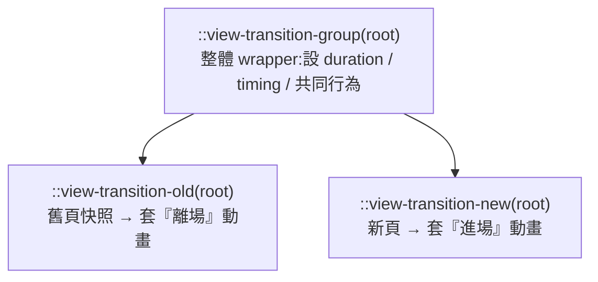

# CSS View Transitions:用純 CSS 讓「多頁網站」有單頁 App 般的轉場動畫

> 來源:Coding2GO(Fabian)〈CSS Can Now Animate Between Pages〉。瀏覽器現在能用**純 CSS**(不寫 JavaScript)在兩個獨立 HTML 頁面之間做轉場動畫——點一個普通連結,就能像 SPA(單頁應用)那樣淡入淡出、滑入滑出,甚至讓一張圖片「飛」到新頁面的新位置。本筆記整理 **Cross-Document View Transitions** 的用法、三個關鍵偽元素、共享元素動畫,以及上線前的三個注意事項。

---

## 一句話總結

過去要做頁面間的平滑轉場,得靠 SPA 框架或一堆 JS;現在只要一條 `@view-transition { navigation: auto; }`,**多頁(MPA)網站的普通連結就能有 App 般的轉場**。預設是 crossfade,再用 keyframes + 三個偽元素就能客製滑動、共享圖片 morph 等效果——而且是 **progressive enhancement**(不支援的瀏覽器就正常跳頁,不會壞)。

---

## 最小可用:一行啟用預設淡入淡出

```css
/* 所有頁面共用的同一支 CSS 檔 */
@view-transition {
  navigation: auto;
}
```

加上這條後,**同網站**頁面間點連結,舊頁會自動 crossfade 融入新頁。

**兩個前提(很重要):**
- ❌ **不能跨不同 domain**;✅ 同一個網站的頁面才行。
- 兩個頁面必須用**相同的 CSS setup** → demo 裡所有 HTML 共用**同一支 CSS 檔**。

---

## 三個關鍵偽元素

瀏覽器在轉場時會建立一組偽元素,分工如下:



| 偽元素 | 代表 | 通常在這裡設 |
|---|---|---|
| `::view-transition-group(root)` | 整段轉場的容器 | `animation-duration`、`timing-function` 等**共同**設定 |
| `::view-transition-old(root)` | **舊頁**的快照 | 離場動畫的 `animation-name` |
| `::view-transition-new(root)` | **新頁** | 進場動畫的 `animation-name` |

> `root` 參數 = 定址**整頁**。只放慢預設淡入淡出可以這樣:
> ```css
> ::view-transition-group(root) { animation-duration: 1s; }
> ```

---

## 客製動畫:滑入 / 滑出(slide)

用一般的 `@keyframes` 描述動畫,再分別套到舊頁與新頁:

```css
/* 舊頁往左滑出畫面 */
@keyframes slide-out {
  to { transform: translateX(-100vw); }
}
/* 新頁從右邊(畫面外)滑回原位 */
@keyframes slide-in {
  from { transform: translateX(100vw); }
}

::view-transition-group(root) {   /* 共同:時長、緩動 */
  animation-duration: 0.5s;
}
::view-transition-old(root) { animation-name: slide-out; }  /* 離場 */
::view-transition-new(root) { animation-name: slide-in;  }  /* 進場 */
```

效果:點導覽列連結時,舊頁向左滑出、新頁從右滑入——**感覺像 SPA,但其實是各自獨立的 HTML 頁面**。

> **分工原則:** 跟「整段動畫」有關的(duration、timing)放在 `group`;只有 `animation-name`(slide-out / slide-in)分別套在 old / new。

---

## 只動一部分:讓 nav bar 固定不動

預設 `root` 會連**兩頁都有的導覽列**一起滑走,看起來怪。解法是**自訂 view-transition-name**,只動主內容:

```css
/* 只給「主內容」一個自訂的轉場名稱 */
main {
  view-transition-name: page-content;   /* 名稱自取,但兩頁要一致 */
}

/* 改成定址 page-content,而非 root */
::view-transition-group(page-content) { animation-duration: 0.5s; }
::view-transition-old(page-content)   { animation-name: slide-out; }
::view-transition-new(page-content)   { animation-name: slide-in;  }
```

這樣滑動只作用在 `<main>`,**nav bar 留在原地**。你可以給不同區塊各自的 `view-transition-name` 做不同動畫——但作者建議:**多數情況簡單的動畫最好看**。

---

## 最驚豔的:共享元素動畫(shared element transition)

讓「同時存在於兩頁的同一張圖」在跳頁時平滑變形——例如卡片縮圖**展開成**文章頁的 hero 大圖:

```css
/* 兩頁共用同一支 CSS,所以可一次定址卡片圖與 hero 圖 */
.card-image,
.hero-image {
  view-transition-name: article-image;   /* 兩者同名 */
}
```

瀏覽器會為這張圖建立獨立的轉場 group,**比對舊位置/尺寸與新位置/尺寸,自動在兩個視覺狀態間動畫**。點卡片時,縮圖就「長大」成文章頁的頭圖。

> 小技巧:做這個效果時,把前面的 slide 轉場**先註解掉**,避免同時太多動畫互相干擾。

---

## 上線前三個注意事項

1. **`view-transition-name` 在當前頁面必須唯一。** 如果有多張部落格卡片,**每張圖都要有自己唯一的名稱**(demo 只有一張卡所以沒事)。
2. **無障礙(accessibility):** 有些使用者開了「減少動態效果」。把整套 view transition 包進 media query,尊重使用者設定:
   ```css
   @media (prefers-reduced-motion: no-preference) {
     /* 只有在使用者沒要求減少動態時才套用轉場 */
     @view-transition { navigation: auto; }
     /* …其餘 ::view-transition-* 設定… */
   }
   ```
3. **瀏覽器支援:** Cross-Document View Transitions 目前支援 **Chrome / Edge / Safari,Firefox 尚未支援**。開發時用 live server 可能有奇怪 glitch(作者改用 Edge 錄製)。當作 **progressive enhancement** 即可——不支援的瀏覽器就正常跳頁,**不會壞,只是少了動畫**。

---

## 應用案例:什麼時候該用

- **多頁式的部落格 / 作品集 / 電商:** 不想為了轉場動畫整站改寫成 SPA 框架時,用純 CSS 就能讓「列表 → 詳情頁」有絲滑感(卡片圖 morph 成詳情頁 hero 是電商/作品集的殺手級效果)。
- **漸進增強既有網站:** 因為不支援就 fallback 成正常導航,可以**直接加在現有 MPA 上**,零風險地給現代瀏覽器使用者更好的體驗。
- **取代部分 JS 動畫:** 過去靠 JS(或框架的 page transition)做的跨頁動畫,部分情境可改用零 JS 的 CSS 方案,減少依賴與包體積。
- **設計品味提醒:** 能給每區塊不同 `view-transition-name` 做複雜編排,但「**簡單動畫通常最好看**」——別過度設計,並務必加上 `prefers-reduced-motion` 守則。

> 與本庫前端/設計相關筆記可對照:[[ai-website-building-claude-code]](用 Claude Code 做網站,含捲動動畫)。

---

## 來源

- Coding2GO(Fabian),〈CSS Can Now Animate Between Pages〉,YouTube:<https://www.youtube.com/watch?v=XH1G58QqPIM>(2026-06-04)
- 相關 Web 標準:CSS View Transitions API(`@view-transition`、`::view-transition-old/new/group`、`view-transition-name`)。
