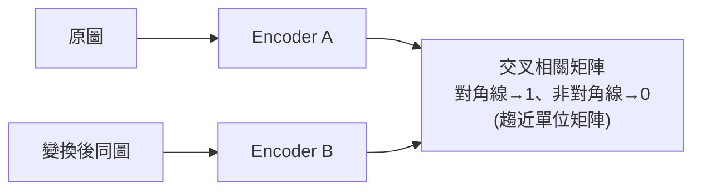

# Yann LeCun 押 10 億美元賭 LLM 的另一條路:JEPA 與世界模型(上)

**主題分類:** AI / 世界模型與自監督學習
**來源:** YouTube 影片〈Yann LeCun's $1B Bet Against LLMs〉(Welch Labs,2026-05-02,約 37 分;兩部曲之一。本筆記依完整逐字稿整理)
**整理日期:** 2026-05-25

---

## 1. 核心命題

AI 傳奇 Yann LeCun 募了 **10 億美元** 去做一條不同於 LLM 的路:**JEPA**。它 **不以語言為根基、也不是生成式**——刻意 **不吐出文字/影像/影片**。JEPA 不是單一模型,而是一套訓練 AI 的 **架構/框架**。

- 多數 ML:給輸入 X,訓練模型預測輸出 Y(LLM:給文字 X 預測下一段文字 Y;影像分類:給圖 X 預測標籤 Y)。
- **JEPA 不同:** X 與 Y 各自先過 **編碼器(encoder)** 得到 **embedding**,再由第三個 **predictor** 學習 **「從 X 的 embedding 預測 Y 的 embedding」**。

> LeCun 的看法:LLM 很擅長操縱語言,但「**基本上別的都不行**」——只在「語言本身就是推理基質」的領域強。世界模型路線初期解決 **不同問題**,但 **最終會取代 LLM**。

---

## 2. 歷史脈絡:為何離開生成式

- LeCun 1980s–90s 開創 **CNN**(2012 的 AlexNet 與之神似)。但深度學習 **過度依賴標註資料**;而小孩看極少例子就學會「狗」的概念。
- **「蛋糕」比喻(2015):** 智慧若是蛋糕,**主體是自監督學習**、糖衣是監督學習、櫻桃是強化學習。(當時 RL 被吹捧,他認為 RL 太低效,到不了人類/動物智慧。)
- **自監督在文字上遠比視覺更快成功:** Radford 把 Transformer 改成自監督的 **下一個 token 預測**(7,000 本書預訓練 → 監督微調),在 9 個語言基準勝過各別客製模型——這就是 **GPT-1**,擺脫對人工標註的依賴、解鎖規模。之後 GPT-2(2019)、GPT-3(2020)、ChatGPT(2022)。整個範式 **正中 LeCun 數年前的預測**:大規模自監督預訓練 → 監督 → RL 微調成助理。

---

## 3. 生成式影片預測為何「糊掉」

- 對影片做下一幀 **像素級** 預測,結果模糊,且自回歸下 **越預測越糊成一團**。
- 原因是 **維度爆炸**:LLM 詞彙固定(GPT-2 有 50,257 個離散輸出);但 Full HD 一幀的可能性約 **10 的 1,500 萬次方**,遠超宇宙原子數,不可能枚舉。
- 模型被迫對給定輸入只輸出 **單一幀**,面對「球可能往左或往右彈」的歧義,最佳解是 **預測平均** → 像素一平均就糊掉。

**關鍵轉念:模型真的需要是生成式的嗎?** GPT 預訓練中,生成只是 **代理任務**;真正有價值的是模型學到的 **內部表示(representation)**。那能不能用 **別的訊號** 來學到這些好表示?

---

## 4. 聯合嵌入(Joint Embedding)與表示崩潰

- ~2017–18 發現:學影像表示 **最好的系統不是生成式**。做法:把同一場景的兩個視角(或一張圖 + 其被破壞/變換版)各過 encoder,**逼這兩個 embedding 相同**(因語意相同)。
- 這想法很老——LeCun 在 Bell Labs 早於 1990s 做的 **Siamese network**(偵測偽造簽名):正例(同人)→ embedding 盡量相似;負例(偽造)→ 盡量相異。
- **致命問題:表示崩潰(representation collapse)。** 既然要兩 embedding 盡量相似,網路可以作弊——**對任何輸入都輸出同一向量**(例如全 1),相似度最大化卻什麼都沒學到。
- **舊解法:對比學習(contrastive)** 用正負例。但放大時 **計算昂貴、需大量負例**,最壞情況負例數隨表示維度 **指數成長**。

---

## 5. 突破:Barlow Twins(以「降冗餘」避開崩潰)

- LeCun 與博後 **Stéphane Deny**(Meta,2020)的頓悟,源自神經科學家 **Horace Barlow(1961)**:視覺神經元靠 **降低彼此間的冗餘資訊** 運作。
- 做法:兩個 encoder 對「同批圖 / 其變換版」輸出 embedding,計算兩邊神經元輸出的 **交叉相關矩陣(Pearson 相關)**:
  - **對角線**(對應神經元)→ 希望 **接近 1**(同圖的對應神經元要相關)。
  - **非對角線**(不同神經元)→ 希望 **接近 0**(降冗餘)。
  - 即:**交叉相關矩陣應趨近單位矩陣**。損失函數 = 與單位矩陣的偏差。
- 效果:成功 **避開崩潰** 並學到強表示。

**成果與落差:** Barlow Twins 凍結 encoder + 線性探針(linear probe)在 ImageNet 達 **73.2%**,勝原版 AlexNet(59.3%)10+ 個百分點;但監督式也進步了(2020 ViT 達 88.6%),所以 **2021 年自監督視覺仍落後監督式**。後續簡化為 **VICReg**;FAIR Paris 另開 **DINO** 線;**DINO V3(2025/8)達 88.4%**——**首次有自監督模型在影像分類追平弱監督模型**。DINO 對每個影像 patch 輸出 embedding,比對 patch 相似度即可 **無標註做分割**。

---

## 6. JEPA:在聯合嵌入上蓋世界模型

2022 年 LeCun 把這些線索匯成 60 頁立場論文〈A Path Towards Autonomous Machine Intelligence〉:現行 AI 遠不及人類學習效率(17 歲少年約 20 小時就學會開車,Tesla 餵了數百萬小時也到不了 L3+)。**缺的那塊是「世界模型」**——能預測物理世界的模型;常識 = 一堆世界模型(知道什麼可能、合理、不可能),讓動物用極少嘗試就學會、能預測行動後果、能推理規劃。

- **JEPA = Joint Embedding Predictive Architecture:** 取世界在 t 與 t+1 的觀察 → 各過 encoder → **predictor 從狀態 t 預測狀態 t+1**(可 **以「動作」為條件**)→ 就成了 **世界模型**。
- 與生成式相比:不預測每個像素,只預測 **下一幀的 embedding** → 擺脫不可能的像素預測,讓 predictor **專注於通過 encoder 的顯著特徵**。
  - LeCun 例:行車記錄器影片,生成式會把資源浪費在預測 **路邊樹葉的隨機晃動**(不可預測卻佔很多像素)。
- **VJEPA 2(下集詳談):** 以機器手臂的 **控制訊號為條件**,學會「動作如何改變手臂在嵌入影像中的位置」→ 變成可用於 **機器人規劃/控制** 的世界模型:給定目標狀態圖 → 編碼 → 在世界模型上 **搜尋各種假設動作**,找出能讓預測未來逼近目標的動作序列。
- LeCun 定位:這是 **古典最優控制(1950s–60s)的新版**——不同在於 **用機器學習「學」出模型**,且 **學出輸入的抽象狀態表示**,在該狀態空間裡學模型,這就是 JEPA。

---

## 7. LeCun 的收尾論點(與 agent 直接相關)

> 「我不懂你怎麼能在 agent **無法預測自身行動後果** 的情況下還想建 agentic 系統。」

可靠的 agentic 系統 **必須能預測行動後果** 才能規劃動作序列、達成任務並守住安全護欄;此時 **推論變成「搜尋」而非單純的自回歸預測**——這正是世界模型的核心。(呼應本 repo [[12-factor-agents]]、[[ai-harness-explained]] 對「可靠 agent」的關注,但路線截然不同。)

**下集預告:** 深入 VJEPA 2(對比快速進步的 VLA 機器人控制)、VLJEPA(以不同方式解多模態 LLM 的視覺語言問題)、以及 JEPA 實作「LeJEPA / world model」。

---

## 來源

- [YouTube:Yann LeCun's $1B Bet Against LLMs(Welch Labs,Part 1)](https://youtu.be/kYkIdXwW2AE)
